# PascalCSS - Piano Implementazione Cookie Consent e Analytics

**Data:** 12 Febbraio 2026  
**Stato:** Pianificazione  
**Versione:** 1.0

---

## Indice

1. [Contesto e Obiettivi](#contesto-e-obiettivi)
2. [Analisi Stato Attuale](#analisi-stato-attuale)
3. [Cosa Implementare](#cosa-implementare)
4. [Architettura Tecnica](#architettura-tecnica)
5. [Piano di Implementazione Dettagliato](#piano-di-implementazione-dettagliato)
6. [Configurazione Richiesta](#configurazione-richiesta)
7. [Verifica e Testing](#verifica-e-testing)
8. [Note Legali e Privacy](#note-legali-e-privacy)

---

## Contesto e Obiettivi

### Progetto

**PascalCSS** è un progetto educativo personale per imparare lo sviluppo web. Non è un servizio professionale o commerciale.

### Obiettivo dell'Implementazione

Aggiornare il sistema di consenso cookie da un'interfaccia binaria (Accetta/Rifiuta) a un sistema a tre opzioni:

- **Accept All** → abilita tutti i servizi di analytics
- **Necessary Only** → solo cookie essenziali, nessun tracking
- **Reject All** → blocca tutto il tracking non essenziale

### Servizi Analytics da Integrare

1. **Google Analytics 4** (già implementato parzialmente)
2. **Cronitor RUM** (Real User Monitoring - nuovo)
3. **GoatCounter** (Analytics privacy-friendly - nuovo)

### Principi Guida

- ✅ **Consenso esplicito prima del caricamento** di qualsiasi script di analytics
- ✅ **Persistenza della scelta** tramite cookie (compatibile SSR)
- ✅ **Nessun tracking senza consenso** - scripts caricati solo dopo approvazione
- ✅ **Privacy by design** - GoatCounter non raccoglie PII
- ✅ **Conformità GDPR** - controllo granulare dell'utente

---

## Analisi Stato Attuale

### ✅ Già Implementato

#### 1. Componente CookieConsent

- **File:** [app/components/CookieConsent.vue](app/components/CookieConsent.vue)
- **UI:** 2 pulsanti (Decline/Accept)
- **Rendering:** Via `<Teleport to="body">`, posizionato in fondo allo schermo
- **Stile:** Supporto dark mode, animazioni slide-up
- **Integrazione:** Incluso in [app.vue](app.vue#L6)

#### 2. Composable useAnalytics

- **File:** [app/composables/useAnalytics.ts](app/composables/useAnalytics.ts)
- **Gestione Consenso:**
  - Usa `useCookie('cookie-consent')` con valori `'accepted' | 'declined' | null`
  - Cookie con maxAge di 1 anno, sameSite: 'lax'
- **Google Analytics:**
  - Caricamento dinamico via `useHead()` solo dopo consenso
  - ID GA letto da `useRuntimeConfig().public.gaId` (attualmente NON definito)
  - Placeholder: `'G-XXXXXXXXXX'`
- **Features:**
  - `trackEvent()` per eventi custom
  - Auto-tracking pageview con Vue Router
  - Prevenzione duplicazione script con flag `scriptInjected`

#### 3. Layout

- **File:** [app.vue](app.vue)
- **Integrazione:** CookieConsent renderizzato a livello root
- **Script:** Nessun inline script per analytics (tutto via composable)

#### 4. Pagine Legali

- **Privacy Policy:** [app/pages/privacy.vue](app/pages/privacy.vue)
  - Menziona Google Analytics 4
  - Afferma che è un progetto di studio non commerciale
  - Elenca diritti dell'utente (rifiuto/revoca consenso)
  - **NON menziona** Cronitor o GoatCounter
- **Terms of Service:** [app/pages/terms.vue](app/pages/terms.vue)
  - Disclaimer generale progetto educativo

### ❌ Mancanze Identificate

1. **Runtime Config non definito** in [nuxt.config.ts](nuxt.config.ts)
   - Manca sezione `runtimeConfig.public` con `gaId`
   - `useRuntimeConfig().public.gaId` attualmente fallback al placeholder

2. **Nessuna integrazione Cronitor RUM**

3. **Nessuna integrazione GoatCounter**

4. **Consent a 2 stati invece di 3**
   - Manca opzione "Necessary Only" (cookies essenziali senza analytics)

5. **Google Consent Mode v2 non implementato**
   - Nessun aggiornamento di `gtag('consent', 'update', ...)`

6. **Variabili d'ambiente non configurate**
   - `NUXT_PUBLIC_GA_ID` documentato ma non impostato
   - Mancano variabili per Cronitor e GoatCounter

---

## Cosa Implementare

### Modifiche al Sistema di Consenso

| Aspetto             | Stato Attuale                      | Stato Futuro                                      |
| ------------------- | ---------------------------------- | ------------------------------------------------- |
| Opzioni UI          | 2 pulsanti (Accept/Decline)        | 3 pulsanti (Accept All/Necessary Only/Reject All) |
| Valori Cookie       | `'accepted' \| 'declined' \| null` | `'all' \| 'necessary' \| 'none' \| null`          |
| Nome Cookie         | `'cookie-consent'`                 | `'pascalcss_cookie_consent'`                      |
| Analytics su Accept | Google Analytics                   | Google Analytics + Cronitor + GoatCounter         |
| Consent Mode        | Non implementato                   | Google Consent Mode v2                            |

### Nuovi Servizi Analytics

#### Google Analytics 4 (Upgrade)

- **Stato:** Parzialmente implementato
- **Da fare:**
  - Aggiungere Consent Mode v2
  - Configurare runtime config correttamente
  - Testare con ID reale

#### Cronitor RUM (Nuovo)

- **Scopo:** Monitoraggio performance e affidabilità (tempi di caricamento, errori)
- **Script:** `https://rum.cronitor.io/script.js`
- **Config:** Client key via `window.cronitor('config', { clientKey })`
- **Caricamento:** Solo con consenso `'all'`

#### GoatCounter (Nuovo)

- **Scopo:** Analytics privacy-friendly, open source, senza raccolta PII
- **Script:** `https://gc.zgo.at/count.js`
- **Config:** Attributo `data-goatcounter` con URL del proprio account
- **Vantaggio:** Privacy by design, conforme GDPR senza consenso esplicito (ma lo richiederemo comunque)
- **Caricamento:** Solo con consenso `'all'`

---

## Architettura Tecnica

### Flusso di Consenso

```mermaid
graph TD
    A[Utente visita sito] --> B{Cookie pascalcss_cookie_consent esiste?}
    B -->|No| C[Mostra Cookie Bar]
    B -->|Sì, value='all'| D[Auto-carica GA + Cronitor + GoatCounter]
    B -->|Sì, value='necessary'| E[Nessun analytics]
    B -->|Sì, value='none'| E
    C --> F{Utente clicca Accept All}
    C --> G{Utente clicca Necessary Only}
    C --> H{Utente clicca Reject All}
    F --> I[Salva cookie='all']
    G --> J[Salva cookie='necessary']
    H --> K[Salva cookie='none']
    I --> D
    J --> E
    K --> E
```



### Stack Tecnologico

- **Framework:** Nuxt 3 (static site generation)
- **Rendering:** Vue 3 Composition API con `<script setup>`
- **State Management:** `useCookie()` per persistenza consenso
- **Script Injection:** `useHead()` per caricamento condizionale
- **Routing:** Vue Router con auto-tracking pageview
- **Dark Mode:** Supporto nativo con Tailwind CSS

### Pattern di Implementazione

#### Composable Pattern

```typescript
// useAnalytics.ts esporta:
export function useAnalytics() {
  const consent = useCookie<ConsentValue>('pascalcss_cookie_consent')

  const acceptAll = () => {
    /* ... */
  }
  const necessaryOnly = () => {
    /* ... */
  }
  const rejectAll = () => {
    /* ... */
  }

  const trackEvent = (eventName: string, params?: object) => {
    /* ... */
  }

  return {
    consent: readonly(consent),
    acceptAll,
    necessaryOnly,
    rejectAll,
    trackEvent,
  }
}
```

#### Component Pattern

```vue
<!-- CookieConsent.vue -->
<script setup lang="ts">
const { consent, acceptAll, necessaryOnly, rejectAll } = useAnalytics()
</script>

<template>
  <Teleport to="body">
    <div v-if="consent === null" class="cookie-bar">
      <button @click="acceptAll">Accept All</button>
      <button @click="necessaryOnly">Necessary Only</button>
      <button @click="rejectAll">Reject All</button>
    </div>
  </Teleport>
</template>
```

#### Script Injection Pattern

```typescript
// Solo quando consent.value === 'all'
if (import.meta.client) {
  useHead({
    script: [
      {
        src: `https://www.googletagmanager.com/gtag/js?id=${gaId}`,
        async: true,
        tagPosition: 'bodyClose',
      },
      {
        innerHTML: `
          window.dataLayer = window.dataLayer || [];
          function gtag(){dataLayer.push(arguments);}
          gtag('js', new Date());
          gtag('consent', 'update', {
            'analytics_storage': 'granted',
            'ad_storage': 'denied'
          });
          gtag('config', '${gaId}');
        `,
        tagPosition: 'bodyClose',
      },
    ],
  })
}
```

---

## Piano di Implementazione Dettagliato

### Step 1: Runtime Configuration

**File:** `nuxt.config.ts`

**Obiettivo:** Definire configurazione pubblica per ID analytics

**Codice da aggiungere:**

```typescript
export default defineNuxtConfig({
  // ... configurazione esistente

  runtimeConfig: {
    public: {
      gaId: process.env.NUXT_PUBLIC_GA_ID || 'G-XXXXXXXXXX',
      cronitorClientKey: process.env.NUXT_PUBLIC_CRONITOR_CLIENT_KEY || '',
      goatCounterCode: process.env.NUXT_PUBLIC_GOATCOUNTER_CODE || '',
    },
  },
})
```

**Variabili d'ambiente richieste:**

- `NUXT_PUBLIC_GA_ID`: Google Analytics 4 Measurement ID (formato: `G-XXXXXXXXX`)
- `NUXT_PUBLIC_CRONITOR_CLIENT_KEY`: Cronitor RUM client key
- `NUXT_PUBLIC_GOATCOUNTER_CODE`: GoatCounter site code (es: `pascalcss`)

---

### Step 2: Refactor Tipo di Consenso

**File:** `app/composables/useAnalytics.ts`

**Modifiche:**

1. Cambiare tipo del cookie da `'accepted' | 'declined' | null` a `'all' | 'necessary' | 'none' | null`
2. Rinominare cookie da `'cookie-consent'` a `'pascalcss_cookie_consent'`
3. Aggiungere type export per riuso

**Tipo da definire:**

```typescript
export type ConsentValue = 'all' | 'necessary' | 'none' | null
```

**Cookie da aggiornare:**

```typescript
const consent = useCookie<ConsentValue>('pascalcss_cookie_consent', {
  maxAge: 60 * 60 * 24 * 365, // 1 anno
  sameSite: 'lax',
})
```

---

### Step 3: Implementare Funzioni di Consenso

**File:** `app/composables/useAnalytics.ts`

**Nuove funzioni da creare:**

#### acceptAll()

```typescript
const acceptAll = () => {
  consent.value = 'all'
  if (import.meta.client) {
    injectGoogleAnalytics()
    injectCronitor()
    injectGoatCounter()
  }
}
```

#### necessaryOnly()

```typescript
const necessaryOnly = () => {
  consent.value = 'necessary'
  // Non caricare nessun analytics
}
```

#### rejectAll()

```typescript
const rejectAll = () => {
  consent.value = 'none'
  // Non caricare nessun analytics
}
```

**Nota:** Le vecchie funzioni `acceptCookies()` e `declineCookies()` vanno rimosse/rinominate.

---

### Step 4: Google Analytics con Consent Mode v2

**File:** `app/composables/useAnalytics.ts`

**Funzione da implementare:**

```typescript
const injectGoogleAnalytics = () => {
  if (scriptInjected.ga) return

  const config = useRuntimeConfig()
  const gaId = config.public.gaId

  if (!gaId || gaId === 'G-XXXXXXXXXX') {
    console.warn('Google Analytics ID not configured')
    return
  }

  useHead({
    script: [
      {
        src: `https://www.googletagmanager.com/gtag/js?id=${gaId}`,
        async: true,
        tagPosition: 'bodyClose',
      },
      {
        innerHTML: `
          window.dataLayer = window.dataLayer || [];
          function gtag(){dataLayer.push(arguments);}
          gtag('js', new Date());

          // Consent Mode v2
          gtag('consent', 'default', {
            'analytics_storage': 'denied',
            'ad_storage': 'denied',
            'ad_user_data': 'denied',
            'ad_personalization': 'denied'
          });

          gtag('consent', 'update', {
            'analytics_storage': 'granted'
          });

          gtag('config', '${gaId}', {
            'anonymize_ip': true,
            'cookie_flags': 'SameSite=Lax;Secure'
          });
        `,
        tagPosition: 'bodyClose',
      },
    ],
  })

  scriptInjected.ga = true
}
```

**Features:**

- Consent Mode v2 con stati default "denied"
- Update a "granted" solo per `analytics_storage` dopo consenso
- IP anonimizzato per privacy
- Cookie con flag Secure e SameSite

---

### Step 5: Integrazione Cronitor RUM

**File:** `app/composables/useAnalytics.ts`

**Funzione da implementare:**

```typescript
const injectCronitor = () => {
  if (scriptInjected.cronitor) return

  const config = useRuntimeConfig()
  const clientKey = config.public.cronitorClientKey

  if (!clientKey) {
    console.warn('Cronitor client key not configured')
    return
  }

  useHead({
    script: [
      {
        innerHTML: `
          window.cronitor = window.cronitor || function() {
            (window.cronitor.q = window.cronitor.q || []).push(arguments);
          };
          window.cronitor('config', { clientKey: '${clientKey}' });
        `,
        tagPosition: 'head',
      },
      {
        src: 'https://rum.cronitor.io/script.js',
        async: true,
        tagPosition: 'bodyClose',
      },
    ],
  })

  scriptInjected.cronitor = true
}
```

**Cosa monitora Cronitor:**

- Performance (Core Web Vitals, tempo di caricamento)
- Errori JavaScript
- Request fallite
- Metriche user experience

---

### Step 6: Integrazione GoatCounter

**File:** `app/composables/useAnalytics.ts`

**Funzione da implementare:**

```typescript
const injectGoatCounter = () => {
  if (scriptInjected.goatcounter) return

  const config = useRuntimeConfig()
  const code = config.public.goatCounterCode

  if (!code) {
    console.warn('GoatCounter code not configured')
    return
  }

  useHead({
    script: [
      {
        src: 'https://gc.zgo.at/count.js',
        async: true,
        'data-goatcounter': `https://${code}.goatcounter.com/count`,
        tagPosition: 'bodyClose',
      },
    ],
  })

  scriptInjected.goatcounter = true
}
```

**Vantaggi GoatCounter:**

- 🔒 Privacy-first: nessun PII raccolto
- 🌍 Open source
- 📊 Statistiche semplici e chiare
- ⚡ Leggero (<1KB)
- ✅ GDPR-friendly by design

---

### Step 7: Flag Script Injection

**File:** `app/composables/useAnalytics.ts`

**Aggiornare la struttura:**

```typescript
const scriptInjected = {
  ga: false,
  cronitor: false,
  goatcounter: false,
}
```

**Scopo:** Prevenire doppia iniezione degli script (importante per evitare duplicati).

---

### Step 8: Auto-inizializzazione al Caricamento

**File:** `app/composables/useAnalytics.ts`

**Logica onMounted:**

```typescript
onMounted(() => {
  if (consent.value === 'all') {
    injectGoogleAnalytics()
    injectCronitor()
    injectGoatCounter()
  }
})
```

**Comportamento:**

- Se l'utente ha già dato consenso in passato, analytics si caricano automaticamente
- Cookie bar rimane nascosto (grazie a `v-if="consent === null"`)

---

### Step 9: Aggiornare CookieConsent UI

**File:** `app/components/CookieConsent.vue`

**Modifiche Template:**

1. **Cambiare condizione di visibilità:**

   ```vue
   <div v-if="consent === null" class="cookie-bar">
   ```

2. **Aggiungere 3 pulsanti:**

   ```vue
   <div class="button-group">
     <button @click="rejectAll" class="btn-reject">
       Reject All
     </button>
     <button @click="necessaryOnly" class="btn-necessary">
       Necessary Only
     </button>
     <button @click="acceptAll" class="btn-accept">
       Accept All
     </button>
   </div>
   ```

3. **Aggiornare testo informativo:**

   ```vue
   <p>
     We use cookies and services like Google Analytics, Cronitor, and GoatCounter
     to understand how you use our site. You can accept all, only necessary cookies,
     or reject all non-essential tracking.
     <NuxtLink to="/privacy">Privacy Policy</NuxtLink>
   </p>
   ```

4. **Importare nuove funzioni:**
   ```vue
   <script setup lang="ts">
   const { consent, acceptAll, necessaryOnly, rejectAll } = useAnalytics()
   </script>
   ```

**Stile Layout Pulsanti:**

- Desktop: flex row, pulsanti affiancati
- Mobile: flex column, pulsanti impilati
- Colors:
  - Accept All: verde/primary
  - Necessary Only: neutro/gray
  - Reject All: rosso/secondary

---

### Step 10: Aggiornare Privacy Policy

**File:** `app/pages/privacy.vue`

**Sezioni da aggiungere/modificare:**

#### Google Analytics (aggiornamento)

```markdown
### Google Analytics 4

Usiamo Google Analytics per capire come i visitatori usano il sito.

**Dati raccolti:**

- Pagine visitate
- Durata sessione
- Origine traffico
- Dispositivo e browser (anonimizzato)

**Consent Mode v2:** Implementato per rispettare le tue preferenze di consenso.

**Link:** [Google Privacy Policy](https://policies.google.com/privacy)
```

#### Cronitor RUM (nuovo)

```markdown
### Cronitor Real User Monitoring

Monitoriamo le performance del sito (tempi di caricamento, errori) per migliorare l'esperienza utente.

**Dati raccolti:**

- Metriche di performance (Core Web Vitals)
- Errori JavaScript
- Tempi di risposta

**Link:** [Cronitor Privacy Policy](https://cronitor.io/privacy)
```

#### GoatCounter (nuovo)

```markdown
### GoatCounter Analytics

Alternativa privacy-friendly per statistiche di base.

**Dati raccolti:**

- Pageview (senza PII)
- Referrer
- Browser e OS (user-agent)

**Privacy:** Non usa cookie di tracking, non raccoglie informazioni personali, open source.

**Link:** [GoatCounter Privacy](https://www.goatcounter.com/help/privacy)
```

#### Controllo Utente (aggiornamento)

```markdown
## I Tuoi Diritti

Puoi scegliere tra:

- **Accept All:** Abilita Google Analytics, Cronitor e GoatCounter
- **Necessary Only:** Solo cookie essenziali, nessun tracking
- **Reject All:** Blocca tutti i servizi di analytics

La tua scelta viene salvata per 1 anno. Puoi cambiarla in qualsiasi momento cancellando i cookie del browser.
```

---

### Step 11: Documentazione Variabili d'Ambiente

**File:** `.env.example` (da creare/aggiornare)

```bash
# Google Analytics 4
# Ottieni il tuo Measurement ID da: https://analytics.google.com/
NUXT_PUBLIC_GA_ID=G-XXXXXXXXXX

# Cronitor RUM
# Registrati su: https://cronitor.io/
# Client Key from: https://cronitor.io/app/settings/rum
NUXT_PUBLIC_CRONITOR_CLIENT_KEY=your_cronitor_client_key_here

# GoatCounter
# Registrati su: https://www.goatcounter.com/
# Usa il codice del tuo sito (es: se l'URL è pascalcss.goatcounter.com, il codice è 'pascalcss')
NUXT_PUBLIC_GOATCOUNTER_CODE=your_goatcounter_code
```

**File:** `README.md` (sezione da aggiungere)

````markdown
## Environment Variables

Create a `.env` file in the project root:

```bash
NUXT_PUBLIC_GA_ID=G-XXXXXXXXXX
NUXT_PUBLIC_CRONITOR_CLIENT_KEY=xxxxx
NUXT_PUBLIC_GOATCOUNTER_CODE=yourcode
```
````

### Getting Credentials

1. **Google Analytics:**
   - Sign up at [Google Analytics](https://analytics.google.com/)
   - Create a GA4 property
   - Copy your Measurement ID (format: `G-XXXXXXXXX`)

2. **Cronitor:**
   - Sign up at [Cronitor](https://cronitor.io/)
   - Go to Settings → RUM
   - Copy your Client Key

3. **GoatCounter:**
   - Sign up at [GoatCounter](https://www.goatcounter.com/)
   - Your code is your subdomain (e.g., `pascalcss` for `pascalcss.goatcounter.com`)

````

---

### Step 12: Netlify Deployment Config
**File:** `netlify.toml` (opzionale - documentazione)

Aggiungere commento/documentazione:

```toml
# Environment variables should be set in Netlify Dashboard:
# Site Settings → Environment Variables
#
# Required variables:
# - NUXT_PUBLIC_GA_ID
# - NUXT_PUBLIC_CRONITOR_CLIENT_KEY
# - NUXT_PUBLIC_GOATCOUNTER_CODE
#
# Note: Variables prefixed with NUXT_PUBLIC_ are exposed to the client
````

**Istruzioni Netlify:**

1. Vai al dashboard Netlify
2. Site Settings → Environment Variables
3. Aggiungi le 3 variabili con i rispettivi valori
4. Redeploy il sito

---

## Configurazione Richiesta

### Variabili d'Ambiente

| Variabile                         | Formato             | Esempio        | Dove Ottenerla                                                                               |
| --------------------------------- | ------------------- | -------------- | -------------------------------------------------------------------------------------------- |
| `NUXT_PUBLIC_GA_ID`               | `G-XXXXXXXXX`       | `G-ABC123XYZ`  | [Google Analytics Admin](https://analytics.google.com/) → Property Settings → Measurement ID |
| `NUXT_PUBLIC_CRONITOR_CLIENT_KEY` | String alfanumerico | `ck_abc123...` | [Cronitor Dashboard](https://cronitor.io/app/settings/rum) → RUM Settings                    |
| `NUXT_PUBLIC_GOATCOUNTER_CODE`    | Nome sito           | `pascalcss`    | Il tuo subdomain GoatCounter (registrati su [goatcounter.com](https://www.goatcounter.com/)) |

### File da Modificare

| File                               | Tipo Modifica              | Priorità |
| ---------------------------------- | -------------------------- | -------- |
| `nuxt.config.ts`                   | Aggiungere `runtimeConfig` | 🔴 Alta  |
| `app/composables/useAnalytics.ts`  | Refactor completo          | 🔴 Alta  |
| `app/components/CookieConsent.vue` | UI upgrade 3 pulsanti      | 🔴 Alta  |
| `app/pages/privacy.vue`            | Aggiornare privacy policy  | 🟡 Media |
| `.env.example`                     | Documentare variabili      | 🟢 Bassa |
| `README.md`                        | Setup instructions         | 🟢 Bassa |

### Dipendenze

Nessuna nuova dipendenza NPM richiesta. Tutto usa:

- Nuxt 3 built-in APIs (`useHead`, `useCookie`, `useRuntimeConfig`)
- Script injection nativo
- Vue 3 Composition API

---

## Verifica e Testing

### Checklist Funzionale

#### Test 1: Accept All

- [ ] Aprire DevTools → Network tab
- [ ] Pulire cookie del browser
- [ ] Ricaricare la pagina
- [ ] Cookie bar deve essere visibile
- [ ] Cliccare "Accept All"
- [ ] Cookie bar scompare
- [ ] Network tab mostra richieste a:
  - `googletagmanager.com/gtag/js`
  - `rum.cronitor.io/script.js`
  - `gc.zgo.at/count.js`
- [ ] Cookie `pascalcss_cookie_consent=all` salvato
- [ ] Ricaricare: cookie bar NON riappare, analytics auto-loading

#### Test 2: Necessary Only

- [ ] Pulire cookie del browser
- [ ] Ricaricare la pagina
- [ ] Cliccare "Necessary Only"
- [ ] Cookie bar scompare
- [ ] Network tab NON mostra richieste analytics
- [ ] Cookie `pascalcss_cookie_consent=necessary` salvato
- [ ] Ricaricare: cookie bar NON riappare, nessun analytics

#### Test 3: Reject All

- [ ] Pulire cookie del browser
- [ ] Ricaricare la pagina
- [ ] Cliccare "Reject All"
- [ ] Cookie bar scompare
- [ ] Network tab NON mostra richieste analytics
- [ ] Cookie `pascalcss_cookie_consent=none` salvato
- [ ] Ricaricare: cookie bar NON riappare, nessun analytics

#### Test 4: Console Errors

- [ ] Aprire DevTools → Console
- [ ] Testare tutti e 3 i flussi di consenso
- [ ] Nessun errore JavaScript deve apparire

#### Test 5: Dark Mode

- [ ] Testare cookie bar in light mode
- [ ] Testare cookie bar in dark mode
- [ ] Verificare leggibilità e contrasto

#### Test 6: Responsive

- [ ] Desktop (>1024px): pulsanti in riga
- [ ] Tablet (768-1024px): layout leggibile
- [ ] Mobile (<768px): pulsanti impilati verticalmente

#### Test 7: Tracking Events (con consenso)

- [ ] Accettare consenso
- [ ] Chiamare `trackEvent('test_event', { param: 'value' })` da console
- [ ] Verificare in GA4 Real-Time che l'evento arriva

#### Test 8: Privacy Compliance

- [ ] Prima del consenso: nessuna richiesta a domini terzi
- [ ] Cookie salvato ha attributi corretti (SameSite, Secure in prod)
- [ ] Privacy policy aggiornata con tutti i servizi

### Strumenti di Verifica

1. **Chrome DevTools:**
   - Network tab → filter by `analytics`, `cronitor`, `goatcounter`
   - Application tab → Cookies → verifica `pascalcss_cookie_consent`
   - Console → nessun errore

2. **Google Analytics Debugger:**
   - Installare [Chrome Extension](https://chrome.google.com/webstore/detail/google-analytics-debugger)
   - Attivare e verificare eventi in console

3. **Cronitor Dashboard:**
   - Dopo accettare consenso e navigare
   - Controllare [Cronitor RUM Dashboard](https://cronitor.io/app/rum)
   - Verificare che sessioni appaiano

4. **GoatCounter Dashboard:**
   - Visitare `https://[your-code].goatcounter.com/`
   - Verificare pageview in real-time

### Testing Produzione vs Sviluppo

| Aspetto          | Sviluppo (localhost) | Produzione (Netlify) |
| ---------------- | -------------------- | -------------------- |
| Cookie Secure    | Non richiesto        | Richiesto (HTTPS)    |
| Analytics ID     | Placeholder OK       | ID reale richiesto   |
| Console warnings | Accettabili          | Da eliminare         |
| Network latency  | Locale               | Verificare CDN       |

---

## Note Legali e Privacy

### Conformità GDPR

✅ **Implementazione conforme:**

- Consenso **opt-in** (no tracking prima del consenso)
- Scelta granulare (Accept All / Necessary Only / Reject All)
- Informativa chiara sui servizi usati
- Persistenza consenso (1 anno)
- Possibilità di revoca (cancellando cookie browser)

⚠️ **Responsabilità dell'utente:**

- Aggiornare Privacy Policy con link ai servizi
- Verificare che le terze parti (Google, Cronitor) siano conformi GDPR
- In caso di raccolta dati da UE, considerare DPA (Data Processing Agreement) con i fornitori

### Disclaimer Progetto Educativo

Come indicato in [terms.vue](app/pages/terms.vue):

- PascalCSS è un **progetto personale educativo**
- **Non è un servizio professionale** o commerciale
- Le informazioni **non costituiscono consulenza**
- **Nessuna garanzia** sull'accuratezza dei contenuti
- Uso **a proprio rischio**
- Responsabilità **limitata a zero**

### Privacy by Design

1. **Google Analytics:**
   - IP anonimizzato (`anonymize_ip: true`)
   - Consent Mode v2 implementato
   - Solo `analytics_storage` granted, no ad storage

2. **Cronitor:**
   - Performance monitoring, non traccia PII
   - Dati aggregati per migliorare UX

3. **GoatCounter:**
   - Privacy-first by design
   - No cookie tracking
   - No PII collection
   - Open source e self-hostable

---

## Prossimi Passi

### Implementazione (da fare)

1. ✏️ Modificare `nuxt.config.ts`
2. ✏️ Refactorare `useAnalytics.ts`
3. ✏️ Aggiornare `CookieConsent.vue`
4. ✏️ Aggiornare `privacy.vue`
5. ✏️ Creare `.env.example`
6. ✏️ Aggiornare `README.md`

### Configurazione (manuale)

7. 🔑 Registrarsi su Google Analytics → ottenere GA ID
8. 🔑 Registrarsi su Cronitor → ottenere Client Key
9. 🔑 Registrarsi su GoatCounter → ottenere Site Code
10. ⚙️ Creare `.env` locale con le credenziali
11. ⚙️ Configurare variabili su Netlify Dashboard

### Testing

12. ✅ Test locale con credenziali reali
13. ✅ Verifica compliance consenso
14. ✅ Test responsive e dark mode
15. ✅ Deploy su Netlify staging
16. ✅ Verifica analytics funzionanti in produzione

---

## Riferimenti

### Documentazione Ufficiale

- [Nuxt 3 Docs](https://nuxt.com/docs)
- [Vue 3 Composition API](https://vuejs.org/guide/extras/composition-api-faq.html)
- [Google Analytics 4](https://developers.google.com/analytics/devguides/collection/ga4)
- [Google Consent Mode v2](https://support.google.com/analytics/answer/9976101)
- [Cronitor RUM Docs](https://cronitor.io/docs/real-user-monitoring)
- [GoatCounter Docs](https://www.goatcounter.com/help)

### Privacy & Legal

- [GDPR Overview](https://gdpr.eu/)
- [Cookie Law EU](https://ec.europa.eu/info/cookies_en)
- [Privacy Shield](https://www.privacyshield.gov/)

### File Progetto

- [IMPLEMENTATION.md](IMPLEMENTATION.md) - Roadmap generale
- [PRD-PascalCSS.md](PRD-PascalCSS.md) - Product Requirements Document
- [README.md](README.md) - Setup e documentazione

---

**Documento creato:** 12 Febbraio 2026  
**Versione:** 1.0  
**Stato:** 📋 Pianificazione completata - In attesa di implementazione  
**Autore:** GitHub Copilot per PascalCSS
